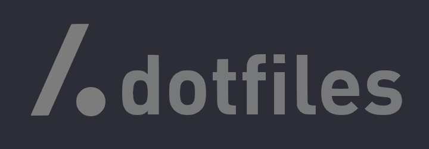

# Hello!!
 
Welcome to my dotfiles!
### Details
- **OS**  
I use [Arch](https://archlinux.org/) BTW!
- **Window Manager**  
[Hyprland](https://github.com/hyprwm/Hyprland) Animations!
- **Theme**  
[Catppuccin](https://github.com/catppuccin/catppuccin) For Everything and I mean EVERYTHING!
- **Shell**  
[Zsh](https://www.zsh.org)  
[powerlevel10k](https://github.com/romkatv/powerlevel10k)
- **Terminal** 
[Kitty](https://sw.kovidgoyal.net/kitty/)
- **Panel** 
[Waybar](https://github.com/Alexays/Waybar)
- **Notify Daemon** 
[SwayOSD](https://github.com/ErikReider/SwayOSD)
- **Launcher** 
[Rofi](https://github.com/davatorium/rofi) 
- **File Manager** 
[Ranger](https://github.com/ranger/ranger)
- **GUI-IDE** 
[Geany](https://www.geany.org/)
- **TUI-IDE** 
[nvim with NVChad](https://nvchad.com/)
## Some Screenshots
 

## Animations and Plugins in action
Will be comming... Eventually...  
PS: I'm too lazy...

<b>OLD Screenshots</b>

